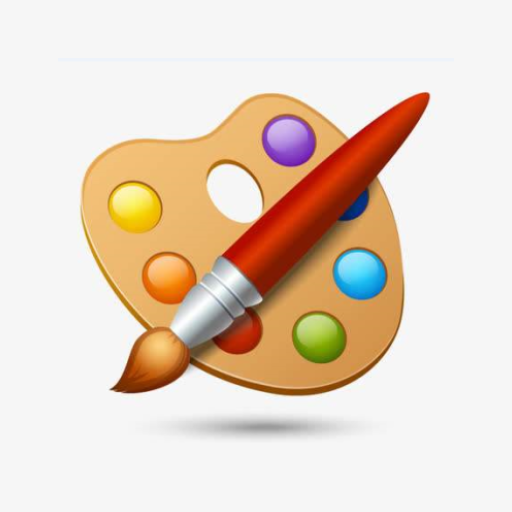

# DrawBoard



[](https://raw.githubusercontent.com/jenly1314/DrawBoard/master/app/release/app-release.apk)
[](https://repo1.maven.org/maven2/com/github/jenly1314/drawboard)
[](https://jitpack.io/#jenly1314/DrawBoard)
[](https://app.travis-ci.com/github/jenly1314/DrawBoard)
[](https://circleci.com/gh/jenly1314/DrawBoard)
[](https://android-arsenal.com/api?level=21)
[](https://opensource.org/licenses/mit-license.php)
[](https://jenly1314.github.io/)
[](http://shang.qq.com/wpa/qunwpa?idkey=8fcc6a2f88552ea44b1411582c94fd124f7bb3ec227e2a400dbbfaad3dc2f5ad)

DrawBoard 是一个自定义 View实现的画板；方便对图片进行各种编辑或涂鸦相关操作。

* 主要支持的一些操作：撤销、恢复、清空、缩放
* 主要支持的绘制模式：画路径、画点、画直线、画矩形、画椭圆、画圆、画文字、画图片、橡皮擦


## Gif 展示


> 你也可以直接下载 [演示App](https://raw.githubusercontent.com/jenly1314/DrawBoard/master/app/release/app-release.apk) 体验效果

## DrawBoardView自定义属性说明
| 属性 | 属性类型 | 默认值 | 属性说明 |
| :------| :------ | :------ | :------ |
| dbvMinZoom | float |1.0| 支持最小的放大倍数 |
| dbvMaxZoom | float |4.0| 支持最大的放大倍数 |
| dbvFit | boolean |true| 是否自适应 |
| dbvDrawEnabled | boolean |true| 是否启用绘图 |
| dbvZoomEnabled | boolean |true| 是否启用缩放 |
| dbvShowTouchPoint | boolean |true| 是否显示触摸点 |
| android:src | drawable | | 设置图片（画板背景图层） |
| dbvPaintColor | color |<font color=#FF0000>#FFFF0000</font>| 画笔的颜色 |
| dbvTouchPointColor | color |<font color=#CCCCCC>#AFCCCCCC</font>| 触摸点的颜色 |
| dbvDrawTextSize | dimension | 15sp | 绘制文本的字体大小 |
| dbvDrawTextBold | boolean | false | 绘制文本是否是粗体 |
| dbvDrawTextUnderline | boolean | false | 绘制文本是否需要下划线 |
| dbvTouchTolerance | float | 4.0 | 触摸时允许的容差值 |
| dbvTouchPointRatio | float | 1.2 | 触摸点的比例 |


## 引入

### Gradle:

1. 在Project的 **build.gradle** 里面添加远程仓库

```gradle
allprojects {
    repositories {
        //...
        mavenCentral()
    }
}
```

2. 在Module的 **build.gradle** 里面添加引入依赖项
```gradle
implementation 'com.github.jenly1314:drawboard:1.0.1'

```

## 示例

布局示例
```xml

    <com.king.drawboard.view.DrawBoardView
        android:id="@+id/drawBoardView"
        android:layout_width="match_parent"
        android:layout_height="match_parent" />

```


主要支持的绘制模式
```kotlin

/**
 * 绘制路径
 */
DrawMode.DRAW_PATH
/**
 * 绘制点
 */
DrawMode.DRAW_POINT
/**
 * 绘制线
 */
DrawMode.DRAW_LINE
/**
 * 绘制矩形
 */
DrawMode.DRAW_RECT
/**
 * 绘制椭圆
 */
DrawMode.DRAW_OVAL
/**
 * 绘制圆
 */
DrawMode.DRAW_CIRCLE
/**
 * 绘制文本
 */
DrawMode.DRAW_TEXT
/**
 * 绘制图片
 */
DrawMode.DRAW_BITMAP
/**
 * 橡皮擦
 */
DrawMode.ERASER

```

```kotlin
/**
 * 如设置绘制模式为：DrawMode.DRAW_PATH
 */
drawBoardView.setDrawMode(DrawMode.DRAW_PATH)
```

主要的一些操作方法
```kotlin
/**
 * 撤销一步
 */
drawBoardView.undo()
/**
 * 恢复一步
 */
drawBoardView.redo()
/**
 * 清除画布
 */
drawBoardView.clear()
/**
 * 改变绘制模式
 */
drawBoardView.setDrawMode(drawMode)
/**
 * 设置画笔颜色
 */
drawBoardView.setPaintColor(paintColor)
/**
 * 设置画笔线条描边宽度
 */
drawBoardView.setLineStrokeWidth(lineStrokeWidth)
/**
 * 设置图片（画板背景图层）
 */
drawBoardView.setImageBitmap(bitmap)
/**
 * 获取图片（画板背景图层和画板图层合并后的图片）
 */
drawBoardView.getImageBitmap()

```

更多使用详情，请查看[Demo](app)中的源码使用示例或直接查看[API帮助文档](https://jitpack.io/com/github/jenly1314/DrawBoard/latest/javadoc/)


## 版本记录

#### v1.0.1：2022-2-17
*  对外提供更多Paint相关配置

#### v1.0.0：2021-11-30
*  DrawBoard初始版本

## 赞赏
如果你喜欢DrawBoard，或感觉DrawBoard帮助到了你，可以点右上角“Star”支持一下，你的支持就是我的动力，谢谢 :smiley:<p>
你也可以扫描下面的二维码，请作者喝杯咖啡 :coffee:
<div>


</div>

## 关于我
Name: <a title="关于作者" href="https://about.me/jenly1314" target="_blank">Jenly</a>

Email: <a title="欢迎邮件与我交流" href="mailto:jenly1314@gmail.com" target="_blank">jenly1314#gmail.com</a> / <a title="给我发邮件" href="mailto:jenly1314@vip.qq.com" target="_blank">jenly1314#vip.qq.com</a>

CSDN: <a title="CSDN博客" href="http://blog.csdn.net/jenly121" target="_blank">jenly121</a>

CNBlogs: <a title="博客园" href="https://www.cnblogs.com/jenly" target="_blank">jenly</a>

GitHub: <a title="GitHub开源项目" href="https://github.com/jenly1314" target="_blank">jenly1314</a>

Gitee: <a title="Gitee开源项目" href="https://gitee.com/jenly1314" target="_blank">jenly1314</a>

加入QQ群: <a title="点击加入QQ群" href="http://shang.qq.com/wpa/qunwpa?idkey=8fcc6a2f88552ea44b1411582c94fd124f7bb3ec227e2a400dbbfaad3dc2f5ad" target="_blank">20867961</a>
   <div>
       
       
   </div>


   
